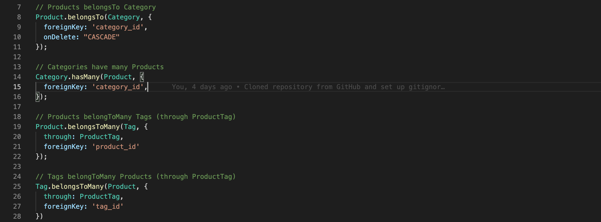
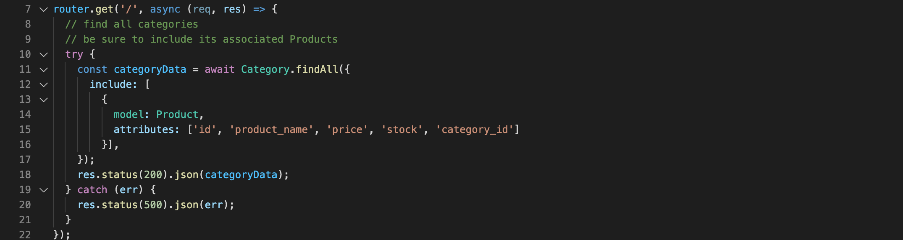
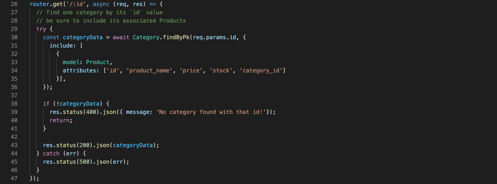
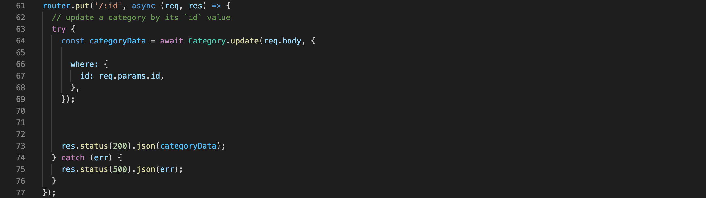
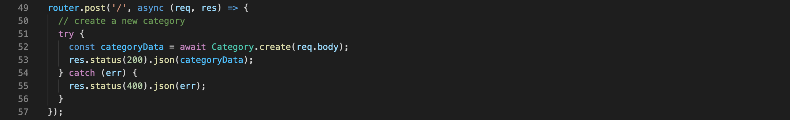
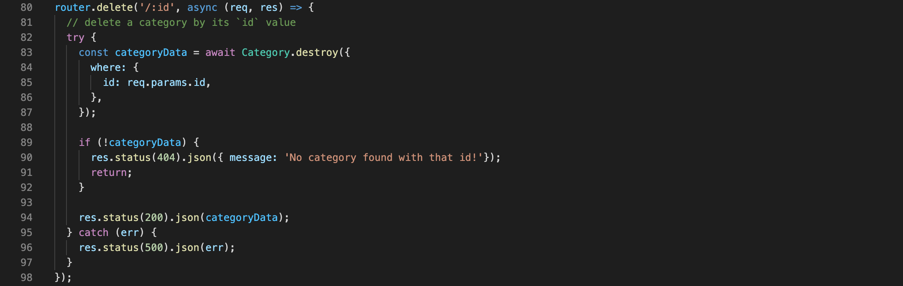

# E-Commerce-App

This project is a back-end application for an e-commerce site utilizing Sequelize and Express.js, applying the principles of Object Relational Mapping.

## User Story

```md
AS A manager at an internet retail company
I WANT a back end for my e-commerce website that uses the latest technologies
SO THAT my company can compete with other e-commerce companies
```

## Acceptance Criteria

```md
GIVEN a functional Express.js API
WHEN I add my database name, MySQL username, and MySQL password to an environment variable file
THEN I am able to connect to a database using Sequelize
WHEN I enter schema and seed commands
THEN a development database is created and is seeded with test data
WHEN I enter the command to invoke the application
THEN my server is started and the Sequelize models are synced to the MySQL database
WHEN I open API GET routes in Insomnia Core for categories, products, or tags
THEN the data for each of these routes is displayed in a formatted JSON
WHEN I test API POST, PUT, and DELETE routes in Insomnia Core
THEN I am able to successfully create, update, and delete data in my database
```

## Set-Up

The following section walks through the set up of the database and respective models from which our data is being stored.

### Database Models

The database for this application contains the following four models, including the requirements listed for each model:

* `Category`

  * `id`

    * Integer.
  
    * Doesn't allow null values.
  
    * Set as primary key.
  
    * Uses auto increment.

  * `category_name`
  
    * String.
  
    * Doesn't allow null values.

* `Product`

  * `id`
  
    * Integer.
  
    * Doesn't allow null values.
  
    * Set as primary key.
  
    * Uses auto increment.

  * `product_name`
  
    * String.
  
    * Doesn't allow null values.

  * `price`
  
    * Decimal.
  
    * Doesn't allow null values.
  
    * Validates that the value is a decimal.

  * `stock`
  
    * Integer.
  
    * Doesn't allow null values.
  
    * Set a default value of `10`.
  
    * Validates that the value is numeric.

  * `category_id`
  
    * Integer.
  
    * References the `Category` model's `id`.

* `Tag`

  * `id`
  
    * Integer.
  
    * Doesn't allow null values.
  
    * Set as primary key.
  
    * Uses auto increment.

  * `tag_name`
  
    * String.

* `ProductTag`

  * `id`

    * Integer.

    * Doesn't allow null values.

    * Set as primary key.

    * Uses auto increment.

  * `product_id`

    * Integer.

    * References the `Product` model's `id`.

  * `tag_id`

    * Integer.

    * References the `Tag` model's `id`.

### Associations

Association methods were executed on the Sequelize models to create the following relationships between them:

* `Product` belongs to `Category`, and `Category` has many `Product` models, as a category can have multiple products but a product can only belong to one category.

* `Product` belongs to many `Tag` models, and `Tag` belongs to many `Product` models. Allow products to have multiple tags and tags to have many products by using the `ProductTag` through model.

These associations were executed in the following manner:



## Development Process

Once the database and the respective models and tables were set up, we needed to complete the routes for the categories, products, and tags. For each, we needed to specify a GET for getting all items in the respective Tag, Category, or Product (note, the following screenshots are examples of these routes from the Category-Route file):



We needed to also create a GET route for a specific id:



Next, we needed a PUT route to update any item indicated by the respective id of the item needing to be updated:



We then created a POST route to actually create a new item:



Lastly, we needed to create a DELETE route so that a specific item could be deleted base on it's id:



Let it be noted that the try/catch method was used, as well as async for these route methods.

## Credits

* MySQL2 - [MySQL2](https://www.npmjs.com/package/mysql2)

* Sequelize - [Sequelize](https://www.npmjs.com/package/sequelize)

* DotEnv - [dotenv](https://www.npmjs.com/package/dotenv)

* Inquirer - [InquirerJs](https://www.npmjs.com/package/inquirer/v/0.2.3) NPM package to interact with the user via the command-line.

* Express = [EspressJs](https://www.npmjs.com/package/express)

## Links

GitHub Repository - [E-Commerce Back-End App Repository](https://github.com/ktrudickm/E-Commerce-App "E-Commerce Back-End App")
